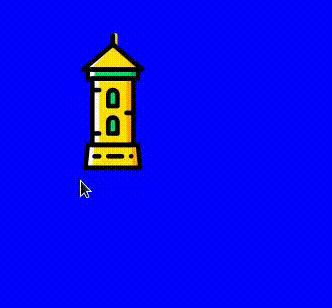
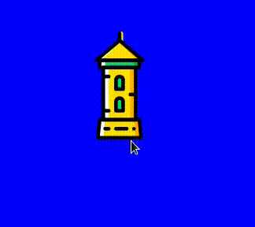

# Tkinter, glisser-déposer des images sur un *canvas*
## Faire glisser l'image

Création du *canvas* et de l'image:

```python
canvas = tk.Canvas(root, width=300, height=300, bg="blue")
canvas.pack(side=tk.RIGHT, expand=True, fill=tk.BOTH)
img = tk.PhotoImage(file="image.png")
cid = canvas.create_image(50, 50, image=img)
```

Ensuite on indique vouloir recevoir les évènements de type glisser-déplacer lié à l'image. Lors de ceux-ci on appellera la fonction *drag*:

```python
canvas.tag_bind(cid, "<B1-Motion>", drag)
```

La fonction *drag* est un simple appel à *coords*, qui prend l'identifiant de l'objet et le déplace aux coordonnés fournis:

```python
def drag(e):
    canvas.coords(cid, e.x, e.y)
```

L'image est maintenant déplaçable en effectuant un glisser-déplacer. Toutefois le déplacement n'est pas fluide. La fonction *coord* déplace en effet le centre de l'image aux coordonnés fournis, peu importe que l'on ai sélectionné une extrémité ou le centre de l'image. On a ainsi l'impression que l'image effectue un saut.



À noter que c'est le centre de l'image qui est placé aux coordonnés donnés mais cela pourrait être un des angles de l'image. Cela est réglable lors de l'appel de *create_image* via le paramètre *anchor*, les valeurs possibles sont: *"n", "ne", "e", "se", "s", "sw", "w", "nw", "center"*.


## Faire glisser l'image sans saccade

On ajoute la gestion d'un second évènement à l'image:

```python
canvas.tag_bind(cid, "<ButtonPress-1>", start_dragging)
```

Lors du clic de la souris, on calcule et mémorise la distance entre notre pointeur et le centre de l'image:

```python
def start_dragging(e):
    global dx, dy
    x, y = canvas.coords(cid)
    dx = e.x - x
    dy = e.y - y
```

On modifie notre fonction drag pour déplacer le centre de l'image aux nouvelles coordonnées moins la distance pointeur-centre:

```python
def drag(e):
    canvas.coords(cid, e.x - dx, e.y - dy)
```
Et voilà !



## Exemple complet

```python
import tkinter as tk


def start_dragging(e):
    global dx, dy
    x, y = canvas.coords(cid)
    dx = e.x - x
    dy = e.y - y


def drag(e):
    canvas.coords(cid, e.x - dx, e.y - dy)


dx = 0
dy = 0
root = tk.Tk()
canvas = tk.Canvas(root, width=300, height=300, bg="blue")
canvas.pack(side=tk.RIGHT, expand=True, fill=tk.BOTH)
img = tk.PhotoImage(file="image.png")
cid = canvas.create_image(50, 50, image=img)
canvas.tag_bind(cid, "<B1-Motion>", drag)
canvas.tag_bind(cid, "<ButtonPress-1>", start_dragging)


root.mainloop()
```

